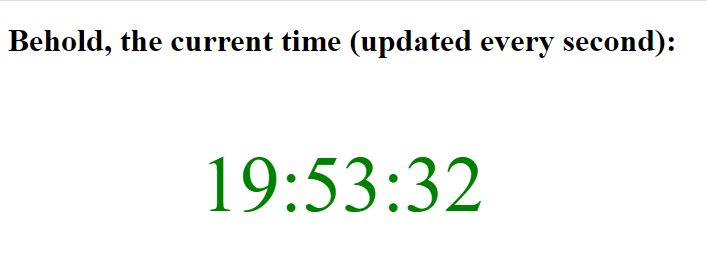

# HyperionDev Full Stack Web Development Bootcamp - Level 2 Task 7a - Advanced Javascript - Time Website

## Description
This is a quick website that uses an asyncronous function and "await" expressions to fetch the time using the Date() function. 

## Table of Contents
* [Instructions](#instructions)
* [Technologies](#technologies)
* [Installation](#installation)
* [Usage](#usage)
* [Credits](#credits) 

## Instructions
These were the instructions I was given to guide me in creating this website. 

* Create a webpage that always displays the current time. The time should be updated every second. Hint: use setInterval.

### Technologies
This project uses:
* HTML 5 
* Javascript ECMAScript 2021

## Installation
There is no special installation for this project. Simply open the [index.html](index.html) file in your web browser.

## Usage
To use this website, simply open the [index.html](index.html) file in your web browser. See figure 1 below.

### Credits
This website was created by Evan Malherbe during the HyperionDev Full Stack Web Development Bootcamp November 2021 [GitHub profile](https://github.com/evanmalherbe) 